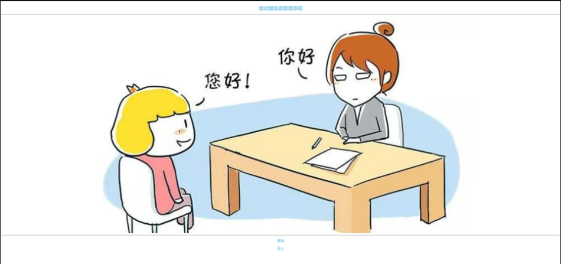
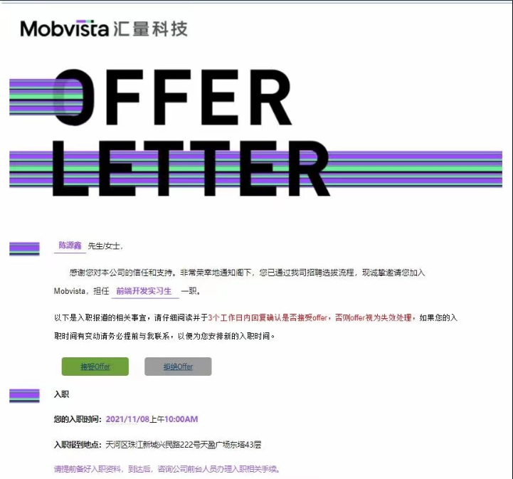
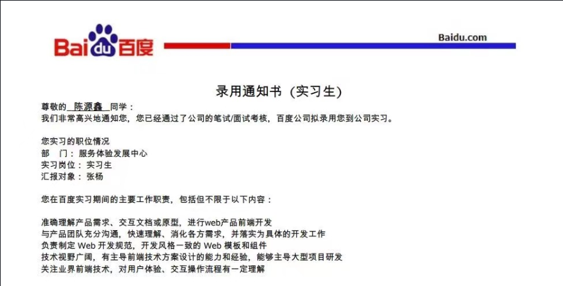
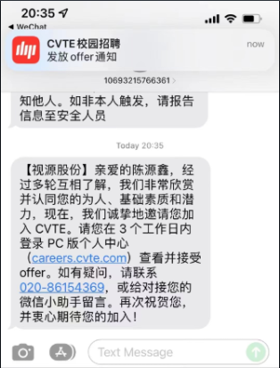
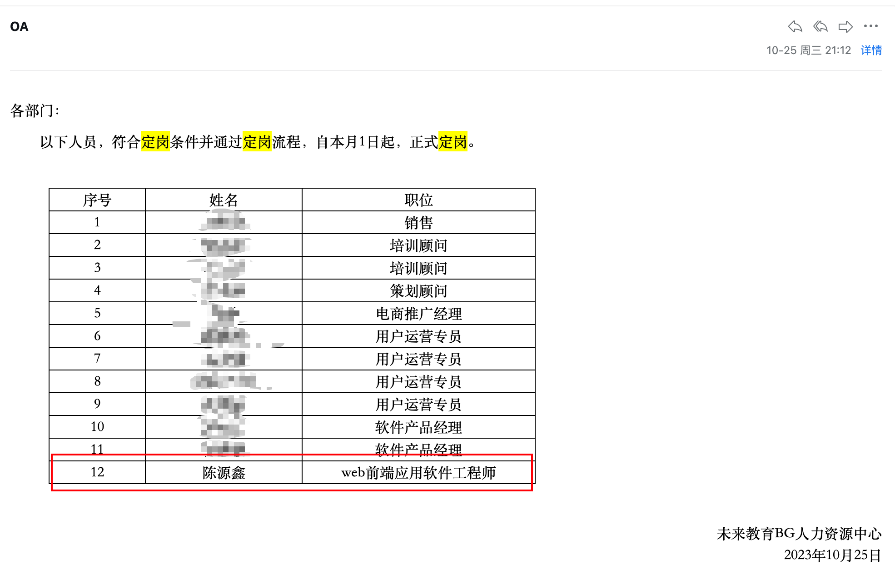
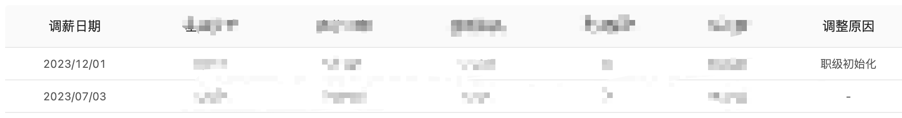

非常感谢你能点进这里来了解我的故事，下面就简单给大家介绍一下我的成长经历，希望对大家有所帮助！

## 大一

大一的时候我一直很迷茫，不知道自己未来的方向在哪里，专业课感觉啥都没学到，这种焦虑感一直支配着我。2020.7.25 我收到了实验室招新的群通知，抱着试一试的态度我报名参加了实验室前端开发岗的面试。
那时我们的考核内容是一个星期的时间做出一个页面，内容不限，现在看起来很简单，但是对于 0 基础的我来说真的是想哭！虽然师兄说尽力就好，但是那时真的太渴望加入实验室了，感觉这是能让我进入大厂的契机。那 7 天，除了睡觉吃饭时间，基本都在看前端课程，最绝望的事情是我那个课程路线竟然是从 js 学起，学了几天我都不知道一个静态页面怎么写！给大家看个笑话，我最后提交的作业。

## 大二

在实验室学习了一段时间后，我也开始去负责一个项目。也是从那时开始，我身上多了一份责任，那就是把这个项目搞好，像师兄一样给实验室的师弟师妹们做一个好榜样。我变得更投入了，我很少去在乎外界的东西，基本每天都肝到 12 点，我知道我的对手不是学校的学生，而是 985、211 的学生，我必须付出更多努力！

## 大三

大三上学期，为了冲击大厂我想先积累一份实习经历，和好朋友一起开始尝试性的投起了实习简历。2021.11.03 投递后，很幸运隔天我就收到了面试通知，2021.11.05 这一天我收获了人生当中第一份实习 offer。公司环境真的很好，我从没有想过自己这么快能进入这样的公司，这一切真的很奇妙。

我一直记得我的目标，到了下学期，我开始准备去找一段大厂实习，为后面的秋招做准备。可能因为有一段实习缘故，拿到了 wps、百度、欢聚的实习 offer，在再三思索下，去到了一个从没有想过的城市（上海）实习。即便大家都说大厂都看学历，但是我不认输，这份实习对于我而言算是一直以来努力的回报。我做到了！

**秋招**

大三暑假的时候，我开始了秋招投递，23 届的秋招只能说从**信心满满到怀疑人生**，寥寥无几的面试。还算幸运，历经两个多月，在 9 月份收获了一份 offer。有遗憾也有喜悦，感觉自己还能做得更好，总之，**不抱怨，提升自己才是捷径**。

**CVTE 工作经历**

2023 年 10 月 1 日成为希沃第一个提前通过试用期的校招生，不是因为天赋，是 9 个月的实习积累

2023 年 12 月 1 日校招前后台中最早晋升、最高职级，📈 涨 💰 啦！！

**总结**

人生如棋，落子无悔！
